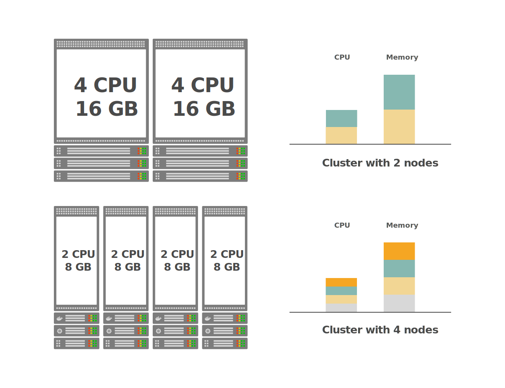
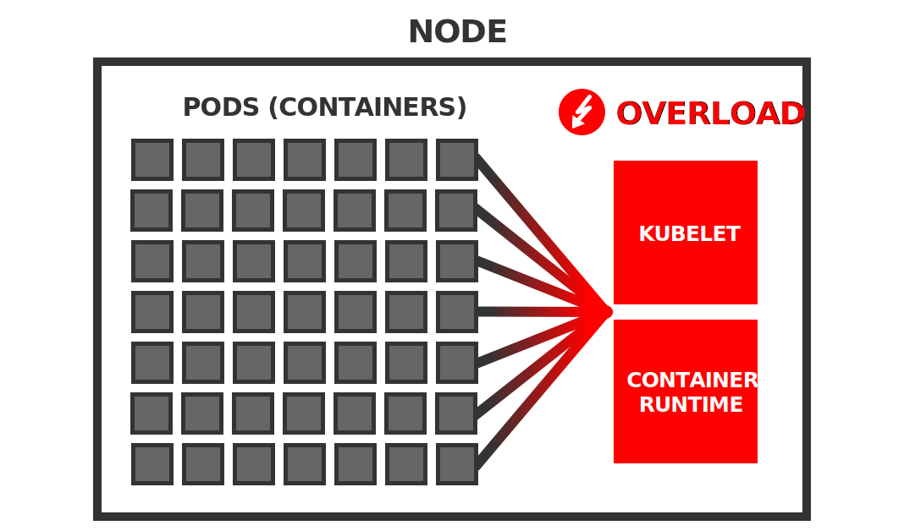
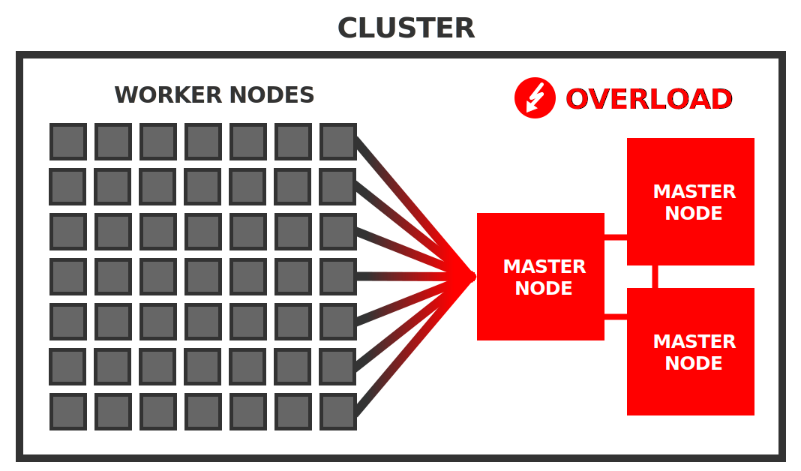

**When you create a Kubernetes cluster, one of the first questions that pops up is: "what type of worker nodes should I use and how many of them?".**

If you're building an on-premises cluster, should you order some last-generation power servers, or use the dozen or so old machines that are lying around in your data centre?

_Or if you're using a managed Kubernetes service like [Google Kubernetes Engine (GKE)](https://cloud.google.com/kubernetes-engine/), should you use 8 `n1-standard-1` or 2 `n1-standard-4` instances to achieve your desired computing capacity?_

## Cluster capacity

In general, a Kubernetes cluster abstracts a set of nodes as a single big node whose total compute capacity (in terms of CPU and memory) is the sum of all the constituent nodes' capacities.

Naturally, there are thus multiple ways to achieve a desired target cluster capacity.

For example, imagine that you need a cluster with a total capacity of 16 CPU cores and 16 GB of RAM.

> For example, because the set of applications that you want to run on the cluster require this amount of resources.

Here are just two of the possible ways to design your cluster:

Both options result in a cluster with the same capacity — but the left option uses 16 smaller nodes, whereas the right one uses 4 larger nodes.

_Which is better?_

To approach this question, let's look at the pros and cons of the two opposing directions of "few large nodes" and "many small nodes".

> Note that "nodes" in this article specifically refers to worker nodes. The choice of number and size of master nodes is a different topic that should be treated separately.

## Few large nodes

The most extreme case in this direction would be to have a single worker node that provides the entire desired cluster capacity.

In the above example, this would be a single worker node with 16 CPU cores and 16 GB of RAM.

_Let's look at the advantages such an approach could have._

### Pros

#### 1. Less management overhead

Simply said, having to manage a small number of machines is less laborious than having to manage a large number of machines.

Updates and patches can be applied more quickly, the machines can be kept in sync more easily.

Furthermore, the absolute number of failures to expect is smaller with few machines than with many machines.

_However, note that this applies primarily to bare metal servers and not to cloud instances._

If you use cloud instances (as part of a managed Kubernetes service or your own Kubernetes installation on cloud infrastructure) you outsource the management of the underlying machines to the cloud provider.

Thus managing, 10 nodes in the cloud is not much more work than managing a 1 node in the cloud.

#### 2. Lower costs per node

While a more powerful machine is more expensive than a low-end machine, the price increase is not necessarily linear.

In other words, a single machine with 10 CPU cores and 10 GB of RAM might be cheaper than 10 machines with 1 CPU core and 1 GB of RAM.

_However, note that this likely doesn't apply if you use cloud instances._

In the current pricing schemes of the major cloud providers [Amazon Web Services](https://aws.amazon.com/ec2/pricing/on-demand/), [Google Cloud Platform](https://cloud.google.com/compute/vm-instance-pricing), and [Microsoft Azure](https://azure.microsoft.com/en-us/pricing/calculator/#virtual-machines), the instance prices increase linearly with the capacity.

For example, on Google Cloud Platform, 64 `n1-standard-1` instances cost you exactly the same as a single `n1-standard-64` instance — both options provide you 64 CPU cores and 240 GB of memory.

So, in the cloud, you typically can't save any money by using larger machines.

#### 3. Allows running resource-hungry applications

Having large nodes might be simply a requirement for the type of application that you are running.

For example, if you have a machine learning application that requires 8 GB of memory, you can't run it on a cluster that has only nodes with 1 GB of memory.

But you can run it on a cluster that has nodes with 10 GB of memory.

_Having seen the pros of few large nodes, let's see what the cons are._

### Cons

#### 1. Large number of pods per node

Running the same workload on fewer nodes naturally means that more pods are running on each node.

_This could become an issue._

The reason is that each pod introduces some overhead on the Kubernetes agents that run on the node — such as the container runtime (e.g. Docker), the kubelet, and cAdvisor.

For example, the kubelet executes regular liveness and readiness probes against each container on the node — more containers means more work for the kubelet in each iteration.

The cAdvisor collects resource usage statistics of all containers on the node, and the kubelet regularly queries this information and exposes it on its API — again, this means more work for both the cAdvisor and the kubelet in each iteration.

If the number of pods becomes large, these things might start to slow down the system and even make it unreliable.

There are reports of [nodes being reported as non-ready](https://github.com/kubernetes/kubernetes/issues/45419) because the regular kubelet health checks took too long for iterating over all the containers on the node.

_For these reasons, Kubernetes [recommends a maximum number of 110 pods per node](https://kubernetes.io/docs/setup/best-practices/cluster-large/)._

Up to this number, Kubernetes has been tested to work reliably on common node types.

Depending on the performance of the node, you might be able to successfully run more pods per node — but it's hard to predict whether things will run smoothly or you will run into issues.

_Most managed Kubernetes services even impose hard limits on the number of pods per node:_

- On [Amazon Elastic Kubernetes Service (EKS)](https://github.com/awslabs/amazon-eks-ami/blob/master/files/eni-max-pods.txt), the maximum number of pods per node depends on the node type and ranges from 4 to 737.
- On [Google Kubernetes Engine (GKE)](https://cloud.google.com/kubernetes-engine/quotas), the limit is 100 pods per node, regardless of the type of node.
- On [Azure Kubernetes Service (AKS)](https://docs.microsoft.com/bs-latn-ba/azure/aks/configure-azure-cni#maximum-pods-per-node), the default limit is 30 pods per node but it can be increased up to 250.

So, if you have many pods but few nodes, you should probably do some tests to check whether Kubernetes still runs smoothly in this situation.

#### 2. Limited replication

A small number of nodes may limit the degree of replication for high-availability applications.

For example, if you have a high-availability application consisting of 5 replicas, but you have only 2 nodes, then the effective degree of replication of the app is reduced to 2.

The 5 replicas can be distributed only across 2 nodes, and if one of them fails, it potentially takes down multiple replicas at once.

On the other hand, if you have at least 5 nodes, each replica can run on a separate node, and a failure of a single node takes down at most one replica.

Thus, if you have high-availability requirements, you might require a certain minimum number of nodes in your cluster.

#### 3. Higher blast radius

If you have only a few nodes, then the impact of a failing node is bigger than if you have many nodes.

For example, if you have only two nodes, and one of them fails, then about half of your pods disappear.

Kubernetes can reschedule workloads of failed nodes to other nodes.

However, if you have only a few nodes, the risk is higher that there is not enough spare capacity on the remaining node to accommodate all the workloads of the failed node.

The effect is that parts of your applications will be permanently down until you bring up the failed node again.

So, if you want to reduce the impact of hardware failures, you might want to choose a larger number of nodes.

#### 4. Large scaling increments

Kubernetes provides a [Cluster Autoscaler](https://github.com/kubernetes/autoscaler/tree/master/cluster-autoscaler) for cloud infrastructure that allows to automatically add or remove nodes based on the current demand.

If you use large nodes, then you have a large scaling increment, which makes scaling more clunky.

For example, if you only have 2 nodes, then adding an additional node means increasing the capacity of the cluster by 50%.

This might be much more than you actually need, and you pay for unused resources.

So, if you plan to automatically scale your cluster, then smaller nodes will enable a more fluid and cost-efficient scaling behaviour.

_Having discussed the pros and cons of few large nodes, let's turn to the scenario of many small nodes._

## Many small nodes

The second approach is to achieve your desired cluster capacity by assembling many small nodes, instead of few large nodes.

_What are the pros and cons of this approach?_

### Pros

The pros of using many small nodes correspond mainly to the cons of using few large nodes.

#### 1. Reduced blast radius

If you have more nodes, you naturally have fewer pods on each node.

For example, if you have 100 pods and 10 nodes, then each node contains on average only 10 pods.

Thus, if one of the nodes fails, the impact is limited to a smaller proportion of your total workload.

Chances are that only some of your apps are affected, and potentially only a small number of replicas so that the apps as a whole stay up.

Furthermore, there are most likely enough spare resources on the remaining nodes to accommodate the workload of the failed node, so that Kubernetes can reschedule all the pods and your apps return to a fully functional state relatively quickly.

#### 2. Allows high replication

If you have replicated high-availability apps, and enough available nodes, the Kubernetes scheduler can assign each replica to a different node.

> You can influence scheduler's the placement of pods with [node and pod affinities/anti-affinities](https://github.com/kubernetes/autoscaler/tree/master/cluster-autoscaler) and with [taints and tolerations](https://kubernetes.io/docs/concepts/configuration/taint-and-toleration/).

This means that if a node fails, there is at most one replica affected and your app stays available.

_Having seen the pros of using many small nodes, what are the cons?_

### Cons

#### 1. Large number of nodes

If you use smaller nodes, you naturally need more of them to achieve a given cluster capacity.

_But large numbers of nodes can be a challenge for the Kubernetes control plane._

For example, every node needs to be able to communicate with every other node, which makes the number of possible communication paths grow by square of the number of nodes — all of which has to be managed by the control plane.

The node controller in the Kubernetes controller manager regularly iterates through all the nodes in the cluster to run health checks — more nodes mean thus more load for the node controller.

More nodes mean also more load on the etcd database — each kubelet and kube-proxy results in a [watcher](https://etcd.io/docs/v3.3.12/dev-guide/interacting_v3/#watch-key-changes) client of etcd (through the API server) that etcd must broadcast object updates to.

In general, each worker node imposes some overhead on the system components on the master nodes.

_Thus, the higher the number of worker nodes, the higher the performance requirements for the master nodes._

This can be nicely seen in the [master node sizes](https://kubernetes.io/docs/setup/best-practices/cluster-large/#size-of-master-and-master-components) used by `kube-up` on cloud infrastructure:

- [Google Cloud Platform](https://cloud.google.com/compute/docs/machine-types)
  - 5 worker nodes → `n1-standard-1` master nodes
  - 500 worker nodes → `n1-standard-32` master nodes
- [Amazon Web Services](https://aws.amazon.com/ec2/instance-types/)
  - 5 worker nodes → `m3.medium` master nodes
  - 500 worker nodes → `c4.8xlarge` master nodes

As you can see, for 500 worker nodes, the used master nodes have 32 and 36 CPU cores and 120 GB and 60 GB of memory, respectively.

_These are pretty large machines!_

Officially, Kubernetes claims to support clusters with [up to 5000 nodes](https://kubernetes.io/docs/setup/best-practices/cluster-large/).

However, in practice, often creating clusters with only 500 nodes already [poses non-trivial challenges](https://www.lfasiallc.com/wp-content/uploads/2017/11/BoF_-Not-One-Size-Fits-All-How-to-Size-Kubernetes-Clusters_Guang-Ya-Liu-_-Sahdev-Zala.pdf).

So, if you intend to compose your cluster of a large number of small nodes, there are two things you need to keep in mind:

- The more worker nodes you have, the larger master nodes you need
- If you plan to use more than 500 nodes, you can expect to hit some performance bottlenecks that require some effort to solve

#### 2. More system overhead

Kubernetes runs a set of system daemons on every worker node — these include the container runtime (e.g. Docker), kube-proxy, and the kubelet including cAdvisor.

> cAdvisor is incorporated in the kubelet binary.

All of these daemons together consume a fixed amount of resources.

If you use many small nodes, then the proportion of your resources used by these system components increases.

For example, assume that the system daemons running on a node together consume 0.1 CPU cores and 0.1 GB of memory.

If your cluster consists of a single node of 10 CPU cores and 10 GB of memory, then the daemons consume 1% of that node's capacity.

On the other hand, if you have 10 nodes of 1 CPU core and 1 GB of memory, then the daemons consume 10% of each node's capacity.

Thus, in the second case, 10% of the resources that you pay for are used for the system, whereas in the first case it's just 1%.

So, if you prefer your computing resources to be used for your workloads rather than for the system, you might prefer larger nodes.

#### 3. Lower resource utilisation

If you use smaller nodes, then you might end up with a larger number of resource fragments that are too small to be assigned to any workload and thus remain unused.

For example, assume that all your pods require 0.75 GB of memory.

If you have 10 nodes with 1 GB memory, then you can run 10 of these pods — and you end up with a chunk of 0.25 GB memory on each node that you can't use anymore.

That means, 25% of the memory that you paid for is wasted.

On the other hand, if you use a single node with 10 GB of memory, then you can run 13 of these pods — and you end up only with a single chunk of 0.25 GB that you can't use.

Thus, in this case, you waste only 2.5% of your memory.

So, if you want to minimise resource waste, using larger nodes might provide better results.

#### 4. Pod limits on small nodes

On some cloud infrastructure, the maximum number of pods allowed on small nodes is more restricted than you might expect.

This is the case on [Amazon Elastic Kubernetes Service (EKS)](https://aws.amazon.com/eks/) where the [maximum number of pods per node](https://github.com/awslabs/amazon-eks-ami/blob/master/files/eni-max-pods.txt) depends on the instance type.

_For small instance types, these numbers can be very low._

For example, for a `t2.medium` instance, the maximum number of pods is 17, for `t2.small` it's 11, and for `t2.micro` it's only 4!

Any pods that exceed these limits, fail to be scheduled by the Kubernetes scheduler and remain in the _pending_ state indefinitely.

If you are not aware of these limits, this can lead to hard-to-find bugs.

Thus, if you plan to use small nodes on Amazon EKS, [check the corresponding pods-per-node limits](https://github.com/awslabs/amazon-eks-ami/blob/master/files/eni-max-pods.txt) and count twice whether the nodes can accommodate your workload.

## Conclusion

_So, should you use few large nodes or many small nodes in your cluster?_

As always, there is no definite answer.

It's possible that one of the applications that you want to deploy on the cluster guides your decision.

For example, if your application requires 10 GB of memory, you probably shouldn't use small nodes — the nodes in your cluster should have at least that amount of memory.

Or if your application requires 10 degrees of replication for high-availability, then you probably shouldn't use just 2 nodes — your cluster should have at least have 10 nodes.

_For all the scenarios in-between it depends on your specific requirements — which of the above pros and cons are relevant for you? Which are not?_

That being said, there is no rule that all your nodes must have the same size.

Nothing stops you from using a mix of different node sizes in your cluster.

In fact, this is what Kubernetes shines at — to turn a set of possibly heterogeneous nodes into a unified "super node".

This might allow you to combine the pros of both approaches and reduce the effect of the cons.

_In the end, the proof of the pudding is in the eating, and the best way to go is to experiment and find the combination that works best for you!_
